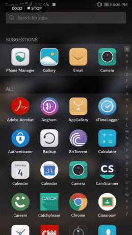

# Plastic-Classification-Android Mobile Application

A convenient resource at your fingertips to save your planet, seas and oceans and raise awareness of plastic hazards through plastic classification for recycling, based on Computer Vision algorithms and Neural Networks.

## Team Members Names
### 1. Sama Elbaroudy
### 2. Perihane Youssef
### 3. Salma Ashraf 

## Demo 
### [Project Demo Video Link](https://drive.google.com/open?id=1LOtMQKHlAmZqM6DJC46BG5qehVZr3W4X)

Press the video link to check the full demo and see multiple plastic product classification

### Demo GIF
This is only a part from the full demo 

  

## Remember before use 

  

## Project Goal
The main goal of our application is to raise awareness of plastic hazards, we want to encourage people to stop using plastics for good. 
If we don’t act now, by the year 2050 there will be more plastic in the ocean than fish.

Facts about the plastic hazards
1. Plastics do not Biodegrade, and never fully Degrade
2. Scientists estimate that 1 million seabirds and 100,000 marine mammals die each year from ingesting plastic. 
3. When plastic does make it into the ocean it breaks down into smaller and smaller pieces known as “microplastics” rather than biodegrading or dissolving, which poses great threats to marine life including fish.

  

4. About 8.3 billion tonnes of plastic has been produced since the 1950s – the weight of roughly a billion elephants or 47 million blue whales.
5. Only about 9% of this plastic has been recycled, 12% has been burned and the remaining 79% has ended up in landfills or the environment.
6. Up to 12.7 million tonnes of plastic enters the oceans every year.
7. The equivalent of a truckload of plastic enters the oceans every minute.
8. Up to 9 of 10 seabirds, 1 in 3 sea turtles and more than half of whale and dolphin species have ingested plastic.

## Project Architecture

### 1. Android Application

#### ORCA APK
https://github.com/Salmaaattia/Plastic-Classification-/blob/master/Android_src_code/app/release/app-release.apk

#### Start using ORCA

To use ORCA application, click on "Start From Here and Save Your Planet" button then click on "Select Photo". 
You can choose a photo for any plastic product from your gallery or take a photo using your mobile camera. 
A ListView will show up multiple fields (Type of plastic, health concern, Recyclability,....), that you can click on any specific field and raise your awareness about our environment, the marine life, health issues and more and more helpful information. 

#### Dependencies used for developing ORCA

- java-sdk 6.2.0

- firebase-database:16.0.4

- firebase-firestore:18.2.0

### 2. Firebase Database
Firebase is an online platform  that we use to store our data.
Our Data is retrieved on a realtime basis, making it easy to modify or update its content, also making the application lighter.
The Data is organized in a collection named __Plastic Types__, which has multiple unique documents for each supported product.

 

##### Each Product has multiple fields:

    a. Intro : brief about the health and environmental issues.  
    b. Type of plastic: One of the 7 types of plastic, PET, HDPE, PVC, LDPE, PP, PS, and other.
    c. Number : this represents the resin number, recycling number.
    d. Recyclability : this shows the recyclability of this type of plastic, as some of them are not highly recyclable or not recyclable in every country.
    e. Recycled Into : this shows the products to which it is recycled into.
    f. Similar Products : products manufactured from the same type of plastic.
    g. How To Use It Less : health and environmental guidelines.
    f. Single-use : if products should be used more than once or not.
    g. If Used More Than Once : health problems if it is used more than once if it is  single-use.
    h. Health Concern : health issues due to use of this plastic.
 
### 4. Computer Vision Techniques

We apply computer vision techniques before classifying 
  1. __Image Resizing__ :
  
  As some images captured by a camera and fed to our AI algorithm vary in size, therefore, we should establish a base size for all images fed into our AI algorithms.
  
  2. __Image Denoising__ :
  
  Where the underlying goal is to estimate the original image by suppressing noise from a noise-contaminated version of the image. Image noise may be caused by different intrinsic (i.e., sensor) and extrinsic (i.e., environment) conditions which are often not possible to avoid in practical situations. Therefore, image denoising plays an important role in image classification applications, where obtaining the original image content is crucial for strong performance. 
  Denoising is established using Median Blur denoising technique.
  
  3. __Increasing brightness__ :
  increasing brightness of the image makes it more clear for classification.
  4. __Increasing contrasts__ :
  increasing contrast makes it more clear for classification.
  
### 5. Classification
first, we went to the object detection and classification approach with the aid of [Tony object detection demo](https://github.com/Tony607/object_detection_demo) , it required several steps
#### 1. Specifying classes 
Based on research we found that the most used and environment endagering plastics are water bottles, plastic bags, plastic,  silverware (fork , knife and spoons ), shampoo and detergent bottles, plastic cups, coffee lids, straws, plastic plates and bottle  caps
#### 2. Data collection
Most of the data are collected from shutterstock and google image.
after collecting we filtered the data to make sure that it's convenient to the classes.
#### 3. Image labelling 
Done with [labelimg](https://github.com/tzutalin/labelImg)
#### 5. Data preprocessing 
Data preprocessing before training is a must 
we filtered the images and resized all the data to (600,800) 
#### 4. Training
Training is done on colab [notebook](https://drive.google.com/open?id=1A7WDR2371HpOgmr-j3OBiYwr5bX0YIu7)
unfortunately after 3 days of labeling and training it didn't give good results

So we used the same data and trained a custom visual recognition model on [ibm watson](https://www.ibm.com/watson) and the results and accuracy were high enough to rely on it 

The input to the model is captured using mobiles's camera then it's preprocessed before classification 
